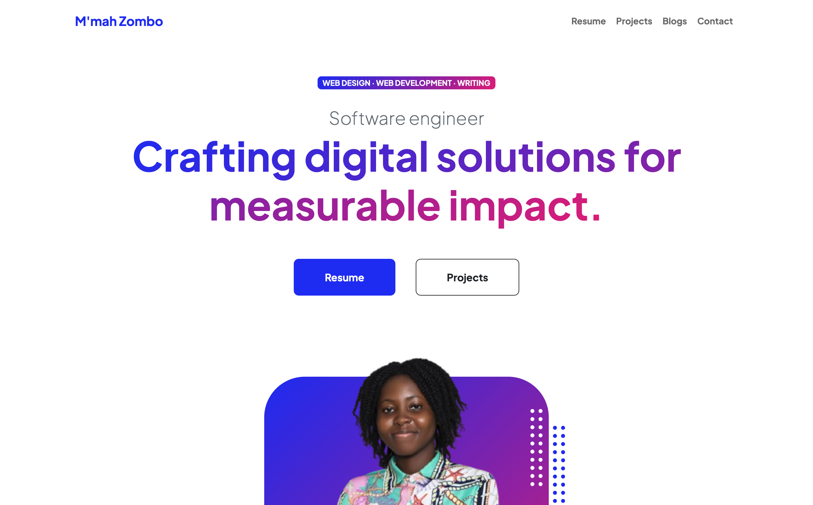

# M'mah Zombo - Professional Portfolio

[](https://mmah-zombo.github.io/)
[](LICENSE)



## 👩🏾‍💻 About

This repository contains the source code for my professional portfolio website, showcasing my work as a **Lead Software Engineer** specialized in full-stack development and digital solutions.

## 🛠️ Technologies Used

- **Frontend**: HTML5, CSS3, JavaScript
- **Frameworks**: [Bootstrap](https://getbootstrap.com/), [Font Awesome](https://fontawesome.com/)
- **Tools**: GitHub Pages (Hosting), Git (Version Control)
- **Optimizations**: SEO-friendly markup, responsive design

## ✨ Key Features

- Clean, modern UI with animations
- Responsive layout (mobile-first approach)
- Project showcase section
- Contact form integration
- Dark/light mode toggle

## 🚀 Installation & Usage

1. Clone the repository:

   ```bash
   git clone https://github.com/Mmah-Zombo/Mmah-Zombo.github.io.git
   ```

2. Open `index.html` in your browser

## 📂 Project Structure

```bash
Mmah-Zombo.github.io/
├── assets/           # Portfolio images and documents
├── css/              # Stylesheets
├── js/               # JavaScript files
├── blogs.html        # Blogs
├── contact.html      # Contact details
├── projects.html     # Top projects
├── index.html        # Main page
├── resume.html       # Professional resume
├── LICENSE           # MIT License
└── README.md         # This file
```

## 📌 Notable Projects Highlighted

- **WanGov**: Government services platform (Lead Developer)
- **TenkiPay**: Digital payment solution (Core Engineer)
- **Climate Call**: Weather application (Full-stack)

## 📜 License

This project is licensed under the MIT License - see the [LICENSE](LICENSE) file for details.

## 📬 Contact

- Email: [mmahzombo55@gmail.com](mailto:mmahzombo55@gmail.com)
- LinkedIn: [M'mah Zombo](https://www.linkedin.com/in/m-mah-zombo-607199271/)
- Portfolio: [https://mmah-zombo.github.io/](https://mmah-zombo.github.io/)
